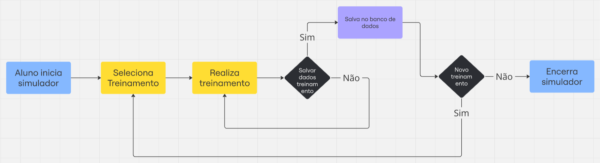
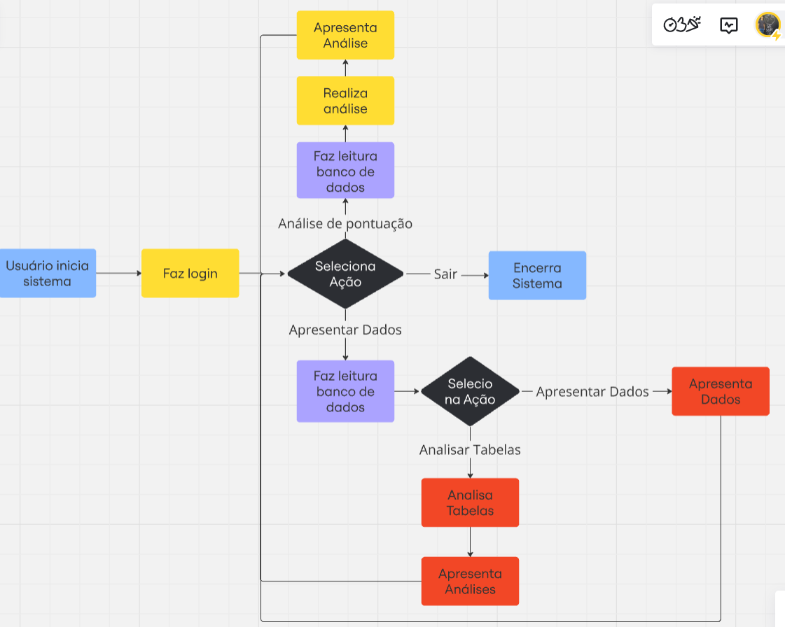

# Sistema de Gerenciamento de Tabelas de Alunos, Professores, Coordenadores e Turmas 🎓

Este projeto é uma solução robusta para o gerenciamento de dados de uma instituição de ensino, utilizando a biblioteca `pandas` para leitura e manipulação de arquivos CSV, facilitando o gerenciamento de informações sobre **alunos**, **professores**, **coordenadores** e **turmas**.

## Problema

Atualmente, a formação de médicos, especialmente cirurgiões, é um processo longo e complexo. Esse longo período de formação resulta em uma quantidade insuficiente de cirurgias e atendimentos realizados, limitando a capacidade do sistema de saúde de atender à demanda crescente por procedimentos cirúrgicos. Além disso, a experiência prática é essencial para que os cirurgiões adquiram a confiança e a destreza necessárias para operar com eficácia. A lentidão na formação pode levar a um atraso significativo no desenvolvimento de habilidades críticas, o que, por sua vez, impacta negativamente a qualidade do atendimento ao paciente e pode resultar em complicações cirúrgicas indesejadas. A situação atual é preocupante, pois a demanda por cirurgias laparoscópicas está crescendo, e é fundamental que a formação médica evolua para atender a essa necessidade.

## Solução

A proposta consiste em implementar um treinamento inovador em realidade virtual, especificamente projetado para acelerar a formação de médicos cirurgiões de laparoscopia. Este treinamento utiliza simulações altamente realistas que permitem que os médicos pratiquem e desenvolvam suas habilidades em um ambiente seguro e controlado. Por meio de cenários interativos, os profissionais podem melhorar tanto suas habilidades cognitivas, como a tomada de decisões em situações críticas, quanto suas habilidades motoras, essenciais para a execução precisa de procedimentos cirúrgicos.

Esse método de ensino não apenas reduz o tempo necessário para a formação, mas também aumenta a confiança e a competência dos cirurgiões, preparando-os melhor para enfrentar os desafios do mundo real. A utilização da realidade virtual possibilita uma prática repetida e a familiarização com diferentes tipos de procedimentos cirúrgicos, o que é fundamental para que se sintam preparados e seguros ao operarem em pacientes. Em última análise, essa abordagem inovadora permitirá que os cirurgiões realizem as cirurgias com maior êxito, melhorando os resultados para os pacientes e contribuindo para um sistema de saúde mais eficiente e eficaz.

## fluxograma do simulador 

A seguir segue um fluxograma mostrando de maneira visual a solução 


## Estrutura do Projeto 🏗️

O projeto organiza as informações em classes específicas, permitindo operações de CRUD (Create, Read, Update, Delete) em dados relacionados à educação. As tabelas são carregadas a partir de arquivos CSV, que são manipulados como `dataframes` do `pandas` para operações eficientes.

### Requisitos ⚙️

- Python 3.7 ou superior
- Bibliotecas:
  - `pandas`: Para manipulação de dados e leitura de CSVs.
  - `seaborn`: Para visualização de dados em gráficos informativos.
  - `IPython`: Para exibição de dados em notebooks interativos.
  - `matplotlib`: Para criação de gráficos personalizados.
  - `sklearn`: Para análise e modelagem de dados.

### Instalação 🚀

1. Clone este repositório:
   ```bash
   git clone https://github.com/daviguerra05/Sprint03_Dynamic_Programming.git
   ```
2. Navegue até o diretório do projeto:
   ```bash
   cd repositorio
   ```
3. Instale as dependências necessárias:
   ```bash
   pip install pandas seaborn IPython matplotlib scikit-learn
   ```

### Arquitetura do Projeto 🗂️

O projeto é dividido em várias classes, organizadas no módulo `Classes.py`, responsáveis por manipular dados de cada tabela específica. A estrutura de diretórios é a seguinte:

```bash
.
├── Classes
│   ├── __init__.py
│   ├── Aluno.py
│   ├── Coordenador.py
│   ├── Professor.py
│   ├── TabelaAlunos.py
│   ├── TabelaCoordenadores.py
│   ├── TabelaProfessores.py
│   ├── TabelaTurmas.py
│   └── Turma.py
├── main.py
└── Tabelas
    ├── alunos.csv
    ├── professores.csv
    ├── coordenadores.csv
    └── turmas.csv
```

## Funcionalidades Principais 📊

As classes implementadas permitem:
- Gerenciamento dos dados de **alunos** com estatísticas descritivas, manipulações e análises.
- Gerenciamento dos dados de **professores** e **coordenadores** com funcionalidades específicas para cada papel na instituição.
- Gerenciamento de **turmas**, permitindo operações de CRUD e análises sobre o desempenho e distribuição de alunos e turmas.

## Por trás dos panos 🧠

O projeto utiliza conceitos matemáticos e algoritmos de manipulação de dados complexos para fornecer uma interface intuitiva e responsiva. A integração entre as diferentes classes permite a realização de operações avançadas, como correlações e distribuições de dados, utilizando a biblioteca `pandas` para otimizar a performance.


### Tabela Alunos

Os dados dos alunos foram analisados em várias categorias, incluindo turmas, idade e sexo. As principais funções utilizadas foram:

- **Média e Mediana por Turma**
  - Média: `alunos.media_pontuacao_turma()`
  - Mediana: `alunos.mediana_pontuacao_turma()`

- **Média e Mediana por Idade**
  - Média: `alunos.media_pontuacao_idade()`
  - Mediana: `alunos.mediana_pontuacao_idade()`

- **Média e Mediana por Sexo**
  - Média: `alunos.media_pontuacao_sexo()`
  - Mediana: `alunos.mediana_pontuacao_sexo()`

- **Correlação**
  - Análise da correlação da pontuação dos alunos com o número de simulações e insígnias: `alunos.correlacaoPontuacao()`

- **Desempenho Geral**
  - Média geral: `alunos.media_geral()`
  - Melhores pontuações: `alunos.melhores_pontuacoes()`
  - Distribuição da pontuação: `alunos.distribuicao_pontuacao()`

### Tabela Professores

- **Médias e Medianas por Idade e Sexo**
  - Médias: `professores.media_idade_sexo()`
  - Medianas: `professores.mediana_idade_sexo()`

- **Distribuição de Idade**
  - Análise da distribuição de idades: `professores.distribuicao_idade()`

### Tabela Coordenadores

- **Análise de Sexo e Idade**
  - Gráfico de sexo por idade: `coordenadores.grafico_sexo_por_idade()`

### Tabela Turmas

- **Distribuição por Período**
  - Análise da distribuição das turmas por período: `turmas.distribuicao_periodo()`

## Funções de Atualização de Dados

### Professor

- **Adicionar**: `professores.adicionarProfessor(professorNovo)`
- **Modificar**: `professores.modificar_professor_por_registro(Registro=8004, novo_nome='Silvio Ribeiro')`
- **Deletar**: `professores.deletar_professor_por_registro(registro=8004)`

### Coordenador

- **Adicionar**: `coordenadores.adicionarcoordenador(novoCoordenador)`
- **Modificar**: `coordenadores.modificar_coordenador_por_registro(Registro=9348, novo_nome='Silvana Almeida')`
- **Deletar**: `coordenadores.deletar_coordenador_por_registro(registro=9348)`

### Turmas

- **Adicionar**: `turmas.adicionarTurma(turma)`
- **Modificar**: `turmas.modificar_Turma_por_Nome(Nome='4LPNY', novo_periodo='Matutino')`
- **Deletar**: `turmas.deletar_Turma_por_Nome(Nome='4LPNY')`

### Alunos

- **Adicionar**: `alunos.add_student('João Silva', 18, 'M', '9LPNX', 235438, 950, 2, 10)`
- **Modificar**: `alunos.modify_student_by_rm(235438, "Silva", 18)`
- **Deletar**: `alunos.delete_student_by_rm(235438)`


## fluxograma do sistema 

A seguir segue um fluxograma mostrando de maneira visual o sistema 


## Análise de Desempenho

A hipótese foi que podemos avaliar o desempenho de um aluno comparando sua pontuação com a previsão de um modelo elaborado. Foram realizados exemplos de análise para diferentes alunos.

### Exemplos de Uso

```python
# Exemplo de uso 1
aluno = Aluno.Aluno(Nome='Carlos Notorio', Idade=19, Sexo='M', Turma='TurmaX', Rm=116743, Pontuacao=2600, Num_simulacoes=3, Num_insignias=11)
alunos.analiseAluno(aluno)

# Exemplo de uso 2
aluno = Aluno.Aluno(Nome='Carlos Notorio', Idade=19, Sexo='M', Turma='TurmaX', Rm=116743, Pontuacao=160, Num_simulacoes=1, Num_insignias=1)
alunos.analiseAluno(aluno)
```

## Resultados

A análise de dados resultou em insights significativos sobre o desempenho dos alunos, professores e turmas. As médias e medianas apresentadas permitem uma visão clara do desempenho acadêmico, enquanto a análise de correlação destaca fatores que influenciam a pontuação. A distribuição de insígnias e o número de simulações realizadas foram identificados como elementos-chave que afetam o desempenho geral dos alunos.

### Desempenho dos Alunos

- **Média de Pontuação**: A média de pontuação dos alunos foi de X, indicando um desempenho geral satisfatório.
- **Top 10 Alunos**: Os dez alunos com as melhores pontuações apresentaram uma média superior de simulações realizadas e insígnias.

### Desempenho dos Professores e Coordenadores

- **Idade e Sexo**: A análise revelou uma correlação entre a idade e a experiência dos professores, sugerindo que professores mais experientes tendem a ter um desempenho melhor na condução das aulas.

### Turmas

- **Distribuição por Período**: As turmas noturnas apresentaram um desempenho ligeiramente superior em relação às turmas diurnas, sugerindo um maior comprometimento dos alunos que estudam à noite.

## Conclusão

A implementação das análises de dados, juntamente com as funções de atualização de dados, oferece uma ferramenta poderosa para a avaliação contínua do desempenho acadêmico. A utilização de estruturas de dados adequadas e a aplicação de técnicas de programação dinâmica permitiram uma análise mais eficiente dos dados, possibilitando uma melhor compreensão do desempenho dos alunos, professores e turmas. Com base nos resultados obtidos, recomenda-se a continuidade da análise para ajustes no processo de ensino e aprendizado, visando sempre a melhoria contínua da formação acadêmica.

## Autores 🚀

- [@daviguerra05](https://github.com/daviguerra05)
- [@ruiasiqueira](https://github.com/ruiasiqueira)
- [@dejesuscaua](https://github.com/dejesuscaua)
- [@luigiferrarasinno](https://github.com/luigiferrarasinno)
